# 🔭 Pydantic Logfire — Production LLM Observability

**Module 4 · Instructor: Divesh · Production-Grade LLM Engineering**

---

## What Is This Module About?

When you build an LLM app and it gives a wrong answer, is slow, or costs too much — how do you figure out *why*?

That's what **observability** solves. This module teaches you to use **Pydantic Logfire** to see exactly what's happening inside your LLM app — in real time, on a dashboard.

```
Without observability:   "My app is slow."  ← you have no idea why

With Logfire:            embed_query   →  12ms   ✅
                         retrieve_docs →   4ms   ✅
                         generate_answer → 834ms  ← HERE is your bottleneck
```

---

## The Big Picture

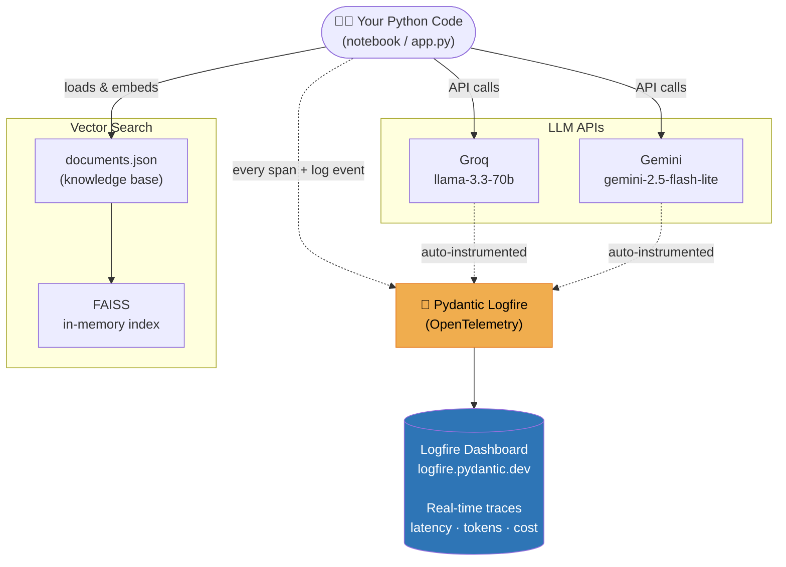

---

## Three Core Concepts (Learn These First)

### 1. Span — a timed block of code

A **span** wraps a piece of code and measures how long it takes.
It also stores any metadata you attach (model name, user id, token count, etc.).

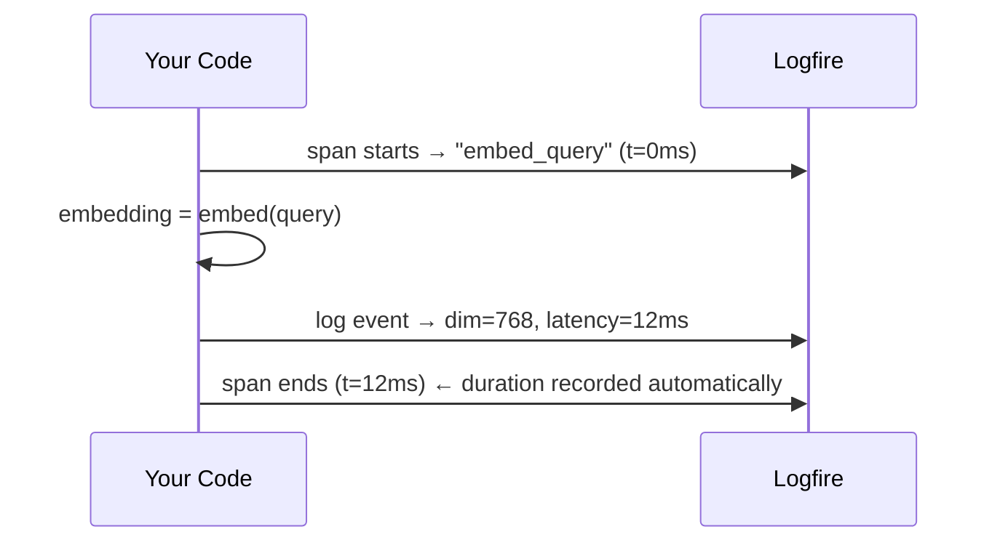

```python
with logfire.span("embed_query", model="gemini-embedding-2-preview"):
    embedding = embed(query)           # code runs here
    logfire.info("done", dim=768)      # log event inside the span
# span closes → duration stored automatically
```

### 2. Trace — a tree of spans

A **trace** is what you get when you nest spans inside each other.
In the Logfire dashboard, a trace appears as a **waterfall** — like a Gantt chart for your code.

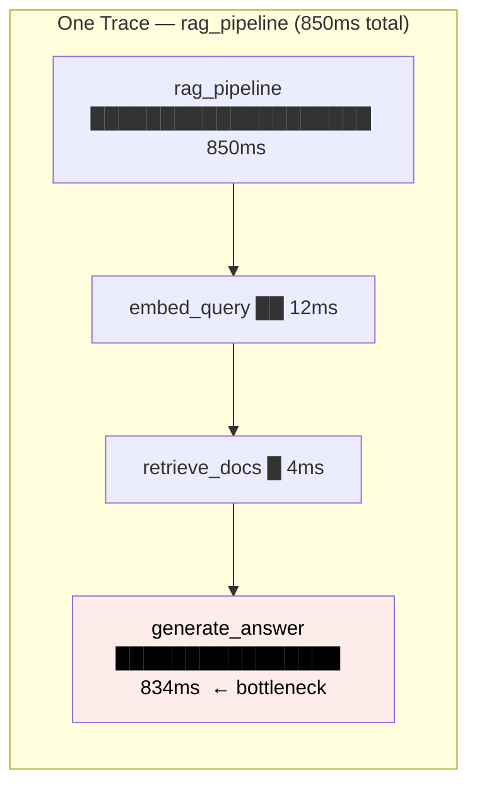

### 3. Attribute — searchable metadata

Every keyword argument you pass to `logfire.span()` or `logfire.info()` becomes a **searchable column** in the dashboard.

```python
logfire.info("docs_retrieved",
             num_docs=2,
             topics=["RAG", "Guardrails"],   # filter by topic
             user_id="alice",                # filter by user
             latency_ms=16.2)               # sort by latency
```

---

## Setup

```bash
# 1. Install
pip install -r requirements.txt

# 2. Fill in .env
LOGFIRE_TOKEN  = "pylf_v1_..."    # logfire.pydantic.dev → Settings → Token
GROQ_API_KEY   = "gsk_..."        # console.groq.com
GEMINI_API_KEY = "..."            # aistudio.google.com

# 3. Open your Logfire dashboard in a browser tab, then run the notebook
```

---

## 📓 The Notebook — 7 Experiments

The notebook (`pydantic_logfire.ipynb`) is split into 3 parts:

| Part | Experiments | What You Learn |
|------|-------------|----------------|
| Part 1 | 1–2 | How Logfire works — spans, logs, Pydantic models |
| Part 2 | 3–5 | Auto-instrumentation — trace any LLM with one line |
| Part 3 | 6–7 | RAG tracing + LangGraph agent with tool observability |

---

### Experiment 1 — Configure Logfire & Your First Span

**What you learn:** The three Logfire primitives — configure, log, span.

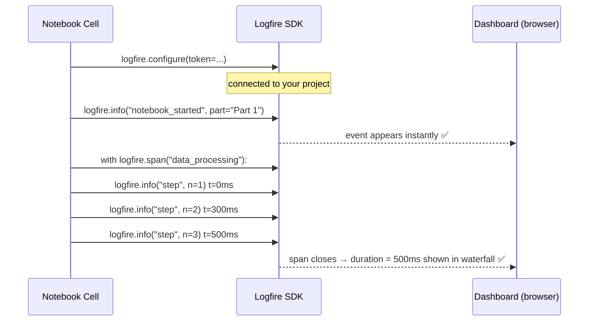

**Key insight:** `logfire.info()` is NOT `print()`. It creates a **structured record** with a timestamp and searchable fields. `logfire.span()` times a block automatically.

---

### Experiment 2 — Structured Logging with Pydantic Models

**What you learn:** Log a Pydantic model → every field becomes a searchable column.

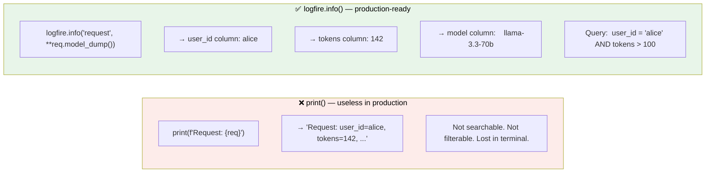

**Key insight:** When you log a Pydantic model, Logfire expands every field into a dedicated searchable column. This is how you do **per-user cost attribution** — filter by `user_id` and sum `output_tokens`.

---

### Experiment 3 — Auto-Instrument Groq (llama-3.3-70b)

**What you learn:** One line of code makes every Groq call traceable — zero extra work.

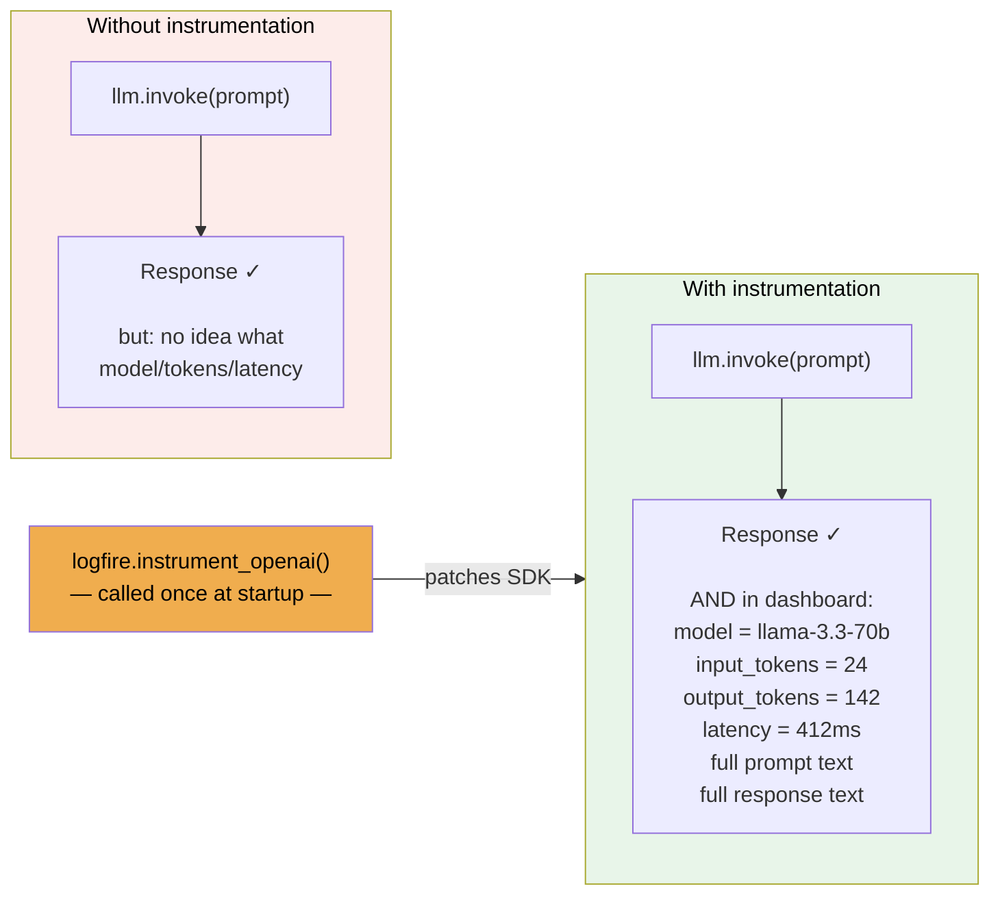

**Key insight:** Groq's API is **OpenAI-compatible** — it uses the same REST format as OpenAI. So `logfire.instrument_openai()` captures Groq calls automatically without any Groq-specific code.

---

### Experiment 4 — Auto-Instrument Gemini (gemini-2.5-flash-lite)

**What you learn:** The exact same setup works for Gemini — one dashboard, two models.

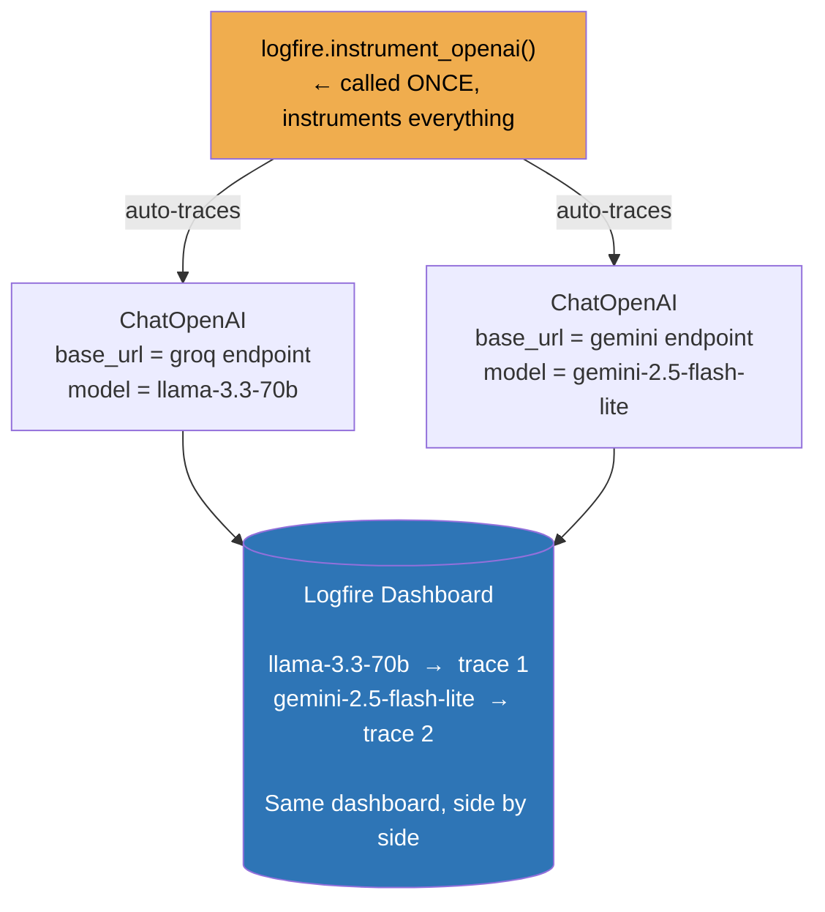

**Key insight:** Both Groq and Gemini expose an **OpenAI-compatible endpoint**. Point `ChatOpenAI` at a different `base_url` and Logfire captures both automatically.

---

### Experiment 5 — Side-by-Side Model Comparison (A/B Test)

**What you learn:** Wrap two LLM calls in a parent span → see them as a waterfall → compare latency and tokens.

```mermaid
gantt
    title Trace Waterfall — model_comparison span
    dateFormat  X
    axisFormat  %Lms

    section Parent
    model_comparison (total)  :0, 1500

    section Groq
    groq_call                 :50, 800

    section Gemini
    gemini_call               :850, 1450
```

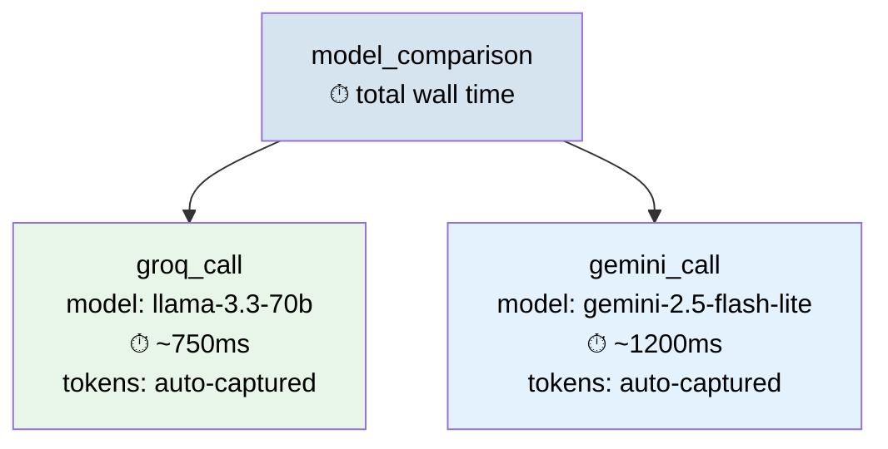

**Key insight:** This is exactly how you do **model A/B testing in production**. Same query, same retrieval, different models. Dashboard tells you which is faster, cheaper, and whether answers differ.

---

### Experiment 6 — Traced RAG Pipeline

**What you learn:** Build a full RAG pipeline from a JSON knowledge base, and trace every stage.

#### How RAG Works

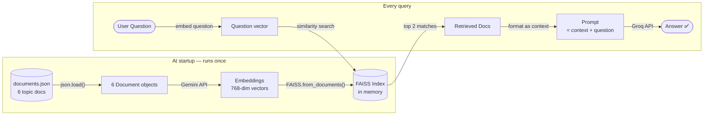

#### What Logfire Captures

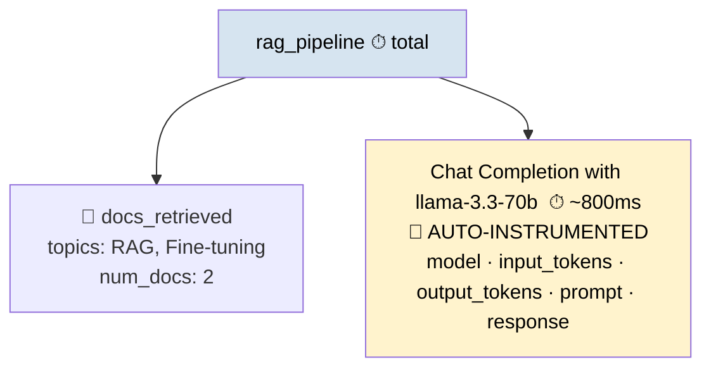

**Key insight:** You can see **which documents were retrieved** for any question — crucial for debugging wrong answers. "Why did the LLM say X?" → check `docs_retrieved` → the wrong document was retrieved.

---

### Experiment 7 — LangGraph ReAct Agent with Retriever Tool

**What you learn:** Build an agent that *decides* whether to search the knowledge base, using a plain Python function as a tool.

#### RAG Chain vs ReAct Agent

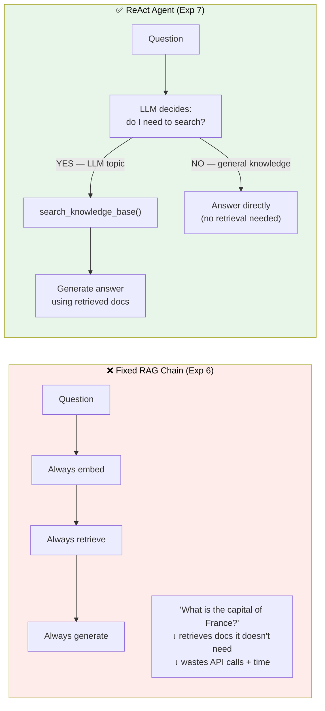

#### How the Tool Is Defined

```python
@tool
def search_knowledge_base(query: str) -> str:
    """Search for LLM topics: RAG, guardrails, observability, evals, fine-tuning."""
    docs = vectorstore.similarity_search(query, k=2)
    return "\n\n".join(f"[{d.metadata['topic']}] {d.page_content}" for d in docs)
```

No `create_retriever_tool`, no wrapper class — just a **plain Python function** with a docstring. The LLM reads the docstring to decide when to call it.

#### Trace Waterfall in Logfire

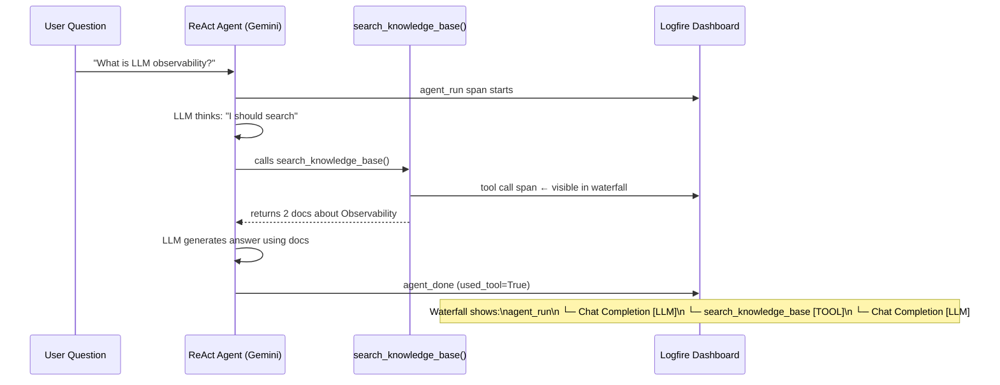

**Key insight:** The tool call span **only appears when retrieval actually happens**. For "What is the capital of France?" — no tool call span. This lets you audit your agent's reasoning from the dashboard.

---

## 🤖 The Streamlit App — Multi-Specialist AI Agent

This is a full **chat application** (`app.py`) powered by a **LangGraph multi-node agent**.

---

### Why Is It Called "Agentic"?

A regular chatbot sends every question to the same LLM with the same prompt. That's a **pipeline** — fixed, no decisions.

An **agent** is different:

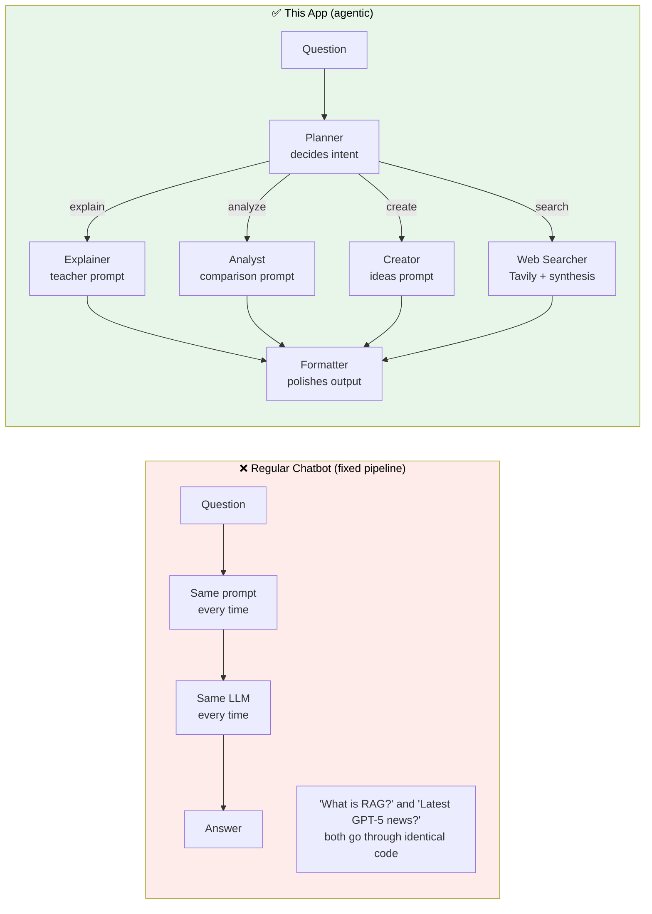

**What makes it agentic:**
- The **Planner decides** which path to take — the code doesn't hardcode which node runs
- Different questions get **different prompts, different tools, different reasoning styles**
- The graph can be extended with new specialist nodes without touching existing ones

---

### The Full Agent Flow

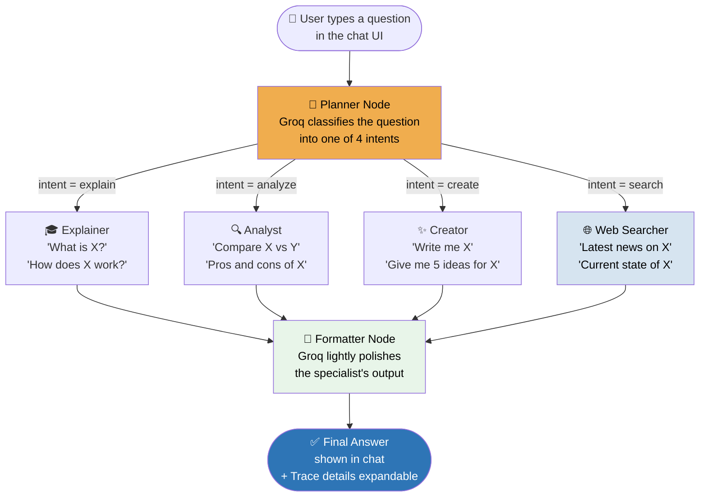

---

### The Nodes — What Each One Does and Why It Exists

#### 🧠 Planner Node
**What it does:** Reads the question and outputs exactly one word: `explain`, `analyze`, `create`, or `search`.

**Why we built it:** Without a planner, you'd need to write `if/elif` chains in Python to route questions. The planner uses the LLM's understanding of language — it catches "elaborate on X" as `explain` and "draft X" as `create` without explicitly programming those synonyms.

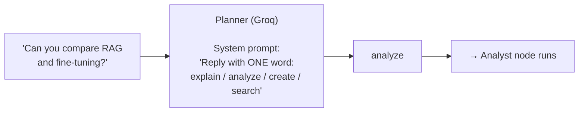

**Trigger words:**

| Intent | Keywords it catches |
|--------|-------------------|
| `explain` | what is, how does, why, tell me about, describe, elaborate |
| `analyze` | compare, vs, pros and cons, evaluate, difference, tradeoffs |
| `create` | write, generate, brainstorm, create, ideas for, draft, give me |
| `search` | latest, current, news, today, recent, 2024, 2025, search for |

---

#### 🎓 Explainer Node
**What it does:** Answers "what is / how does" questions in teacher mode — simple language, analogies, bullet points.

**Why we built it:** A general LLM prompt gives generic answers. A specialist system prompt ("you are an expert teacher, use analogies, aim for 150-250 words") consistently produces cleaner educational output. Separating this from the analyst means you can tune each prompt independently without breaking the others.

```
Sample query  →  "What is the attention mechanism in transformers?"
Expected output  →  Bullet points with analogy, 150-250 words, beginner-friendly
```

---

#### 🔍 Analyst Node
**What it does:** Handles comparison and evaluation questions — structured markdown with headers, pros/cons tables, clear recommendations.

**Why we built it:** Comparisons need a different output format than explanations. If the planner routes "compare RAG vs fine-tuning" to the explainer, you get a paragraph. The analyst gives you a structured breakdown you can actually use to make decisions.

```
Sample query  →  "Compare RAG vs fine-tuning — pros, cons, when to use each"
Expected output  →  Markdown headers, comparison table, recommendation
```

---

#### ✨ Creator Node
**What it does:** Generates ideas, writes content, brainstorms — produces numbered lists of creative, specific, actionable items.

**Why we built it:** Creative tasks need a different mindset from factual tasks. The creator system prompt encourages novelty and specificity, while the explainer prompt encourages accuracy and clarity. Mixing them produces mediocre output for both.

```
Sample query  →  "Give me 5 ideas for an LLM security blog post"
Expected output  →  Numbered list, specific titles + 1-line description each
```

---

#### 🌐 Web Searcher Node
**What it does:** Calls the **Tavily search API** to fetch live web results, then uses Groq to synthesize them into a coherent answer with sources.

**Why we built it:** LLMs have a knowledge cutoff — they don't know about last week's OpenAI announcement. The web searcher is the only node that goes outside the model's training data. It has two internal sub-steps (search → synthesize) which both appear as child spans in Logfire.

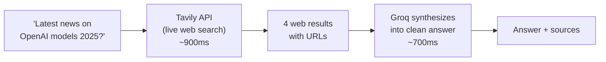

```
Sample query  →  "Latest developments in AI agents in 2025"
Expected output  →  Synthesized summary of recent articles, with source URLs
```

---

#### 📝 Formatter Node
**What it does:** Takes the specialist's output and lightly polishes it — fixes structure, improves readability — **without changing the content**.

**Why we built it:** Specialists are optimized for correctness and depth, not polish. A separate formatting pass means you can improve output quality without touching the specialist prompts. It also demonstrates the pattern of **chaining nodes** in LangGraph — each node has one responsibility.

---

### The 4 Routing Paths

| Intent | Triggered by | Sample query | Node path |
|--------|-------------|-------------|-----------|
| `explain` | what is, how does, why, describe | `"What is RAG?"` | planner → explainer → formatter |
| `analyze` | compare, vs, pros and cons | `"Compare RAG vs fine-tuning"` | planner → analyst → formatter |
| `create` | write, generate, brainstorm, ideas | `"Write 3 blog post ideas about LLM security"` | planner → creator → formatter |
| `search` | latest, current, news, 2025 | `"Latest news on OpenAI models 2025"` | planner → web_searcher → formatter |

---

### 🧪 Sample Queries to Run (Try All 4 Paths)

Copy-paste these into the chat to see every node in action:

```
# Hits EXPLAINER
What is the attention mechanism in transformers?
How does RAG reduce hallucinations?
Why do LLMs hallucinate?

# Hits ANALYST
Compare RAG vs fine-tuning — when should I use each?
Pros and cons of using an LLM gateway like Portkey
What are the tradeoffs between Groq and OpenAI for production?

# Hits CREATOR
Give me 5 ideas for an LLM security course
Brainstorm 3 names for an AI observability startup
Write a short LinkedIn post about why LLM observability matters

# Hits WEB SEARCHER
Latest news on OpenAI models 2025
What is the current state of AI agents in 2025?
Recent developments in LLM safety research
```

**After each query:** expand the "Trace details" section in the chat — it shows `intent`, `path`, and `model_used`. Then open Logfire to see the full waterfall.

---

### The Web Search Path (Deepest Waterfall)

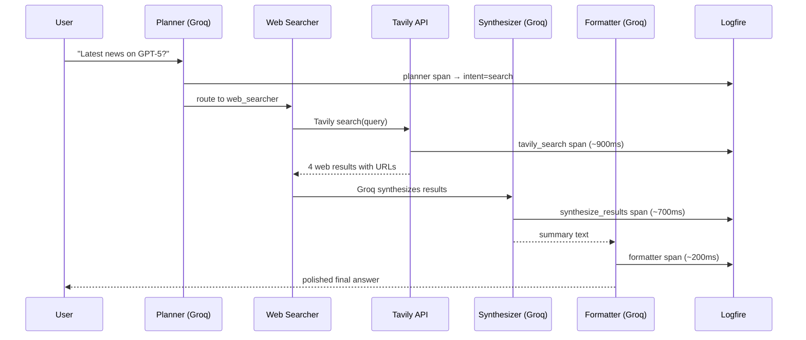

```
Logfire waterfall for a search query:

agent_run                    ██████████████████████████  ~2.1s total
  planner                    ██                          ~280ms
  web_searcher               ██████████████████          ~1.6s
    tavily_search            ████████████                ~900ms  ← external API
    synthesize_results       ████████                    ~700ms
  formatter                  ████                        ~240ms
```

### What You See in the UI

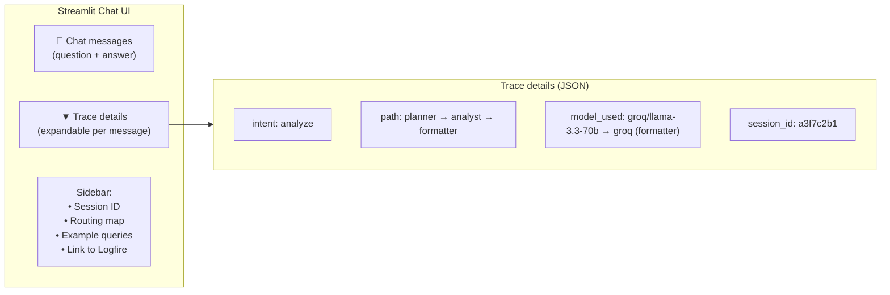

### How the Agent Code Is Organized

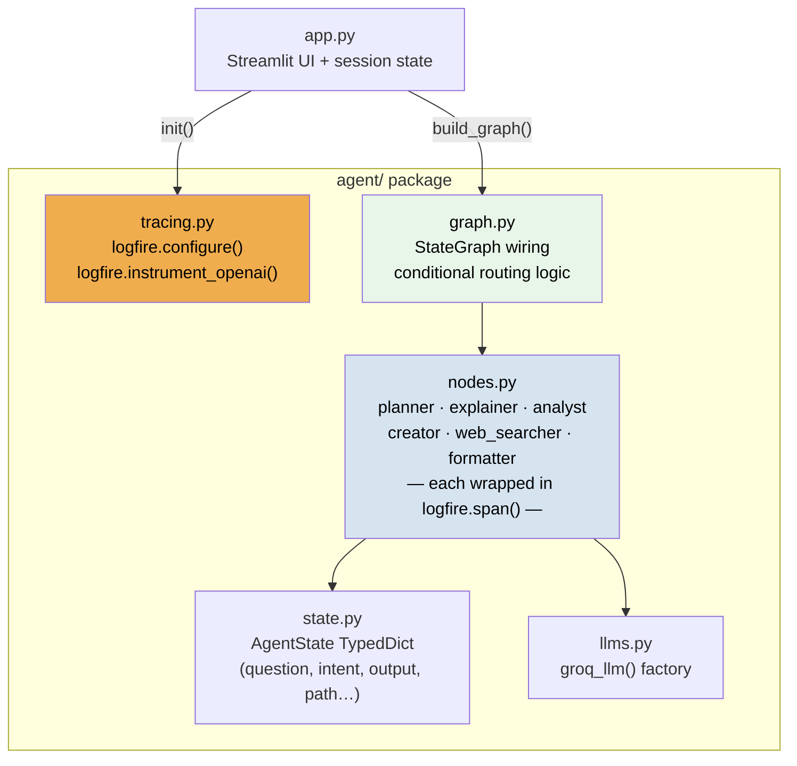

**Each file has one job:**

| File | Does exactly one thing |
|------|----------------------|
| `state.py` | Defines the data shape that flows between nodes |
| `tracing.py` | Configures Logfire once at startup |
| `llms.py` | Creates LLM client objects |
| `nodes.py` | Business logic — each node is a function with a `logfire.span()` |
| `graph.py` | Wires the nodes together and defines routing rules |
| `app.py` | Handles the chat UI — calls the graph, displays results |

---

## 📁 File Structure

```
logifre observability/
│
├── pydantic_logfire.ipynb    ← 7 experiments (run top to bottom)
│
├── documents.json            ← knowledge base for RAG (6 LLM topic docs)
│
├── app.py                    ← Streamlit chat app (run: streamlit run app.py)
│
├── agent/
│   ├── state.py              ← AgentState — data flowing between nodes
│   ├── tracing.py            ← Logfire setup (called once)
│   ├── llms.py               ← Groq LLM factory
│   ├── nodes.py              ← planner, explainer, analyst, creator,
│   │                            web_searcher, formatter
│   └── graph.py              ← LangGraph StateGraph + routing
│
├── requirements.txt
└── .env                      ← LOGFIRE_TOKEN, GROQ_API_KEY, GEMINI_API_KEY
```

---

## 🚀 Running the App

```bash
# Run the notebook
# Open pydantic_logfire.ipynb in Jupyter and run cells top to bottom

# Run the Streamlit app
streamlit run app.py
```

**Test queries that hit all 4 routing paths:**

| Query | Route |
|-------|-------|
| `What is RAG?` | explain → 🎓 Explainer |
| `Compare RAG vs fine-tuning` | analyze → 🔍 Analyst |
| `Write 3 blog post ideas about LLM security` | create → ✨ Creator |
| `Latest news on OpenAI models 2025` | search → 🌐 Web Searcher |

---

## 📖 Key Concepts Quick Reference

| Term | Simple definition |
|------|------------------|
| **Span** | A named, timed block of code — like a stopwatch with labels |
| **Trace** | A tree of spans belonging to one request — visualized as a waterfall |
| **Attribute** | A key-value tag on a span (`user_id="alice"`) — searchable in dashboard |
| **Auto-instrumentation** | `logfire.instrument_openai()` — Logfire patches the SDK so every LLM call is traced automatically |
| **logfire.info()** | A structured log event — like `print()` but searchable and timestamped |
| **logfire.span()** | A timed context manager — measures everything inside it |
| **Token** | Basic unit of LLM input/output — roughly 0.75 words, billing is per token |
| **Embedding** | A list of numbers representing the meaning of text — similar texts have similar numbers |
| **FAISS** | A library that finds the most similar embeddings quickly (vector search) |
| **RAG** | Retrieve relevant docs → inject as context → generate grounded answer |
| **ReAct Agent** | An LLM that loops: Reason → Act (call tool) → Observe result → Reason again |
| **OpenTelemetry** | The open standard for distributed tracing — Logfire implements it |
| **Trace Waterfall** | The dashboard view where each span is a horizontal bar — width = duration |
